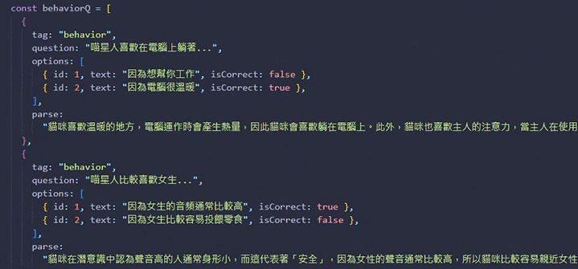
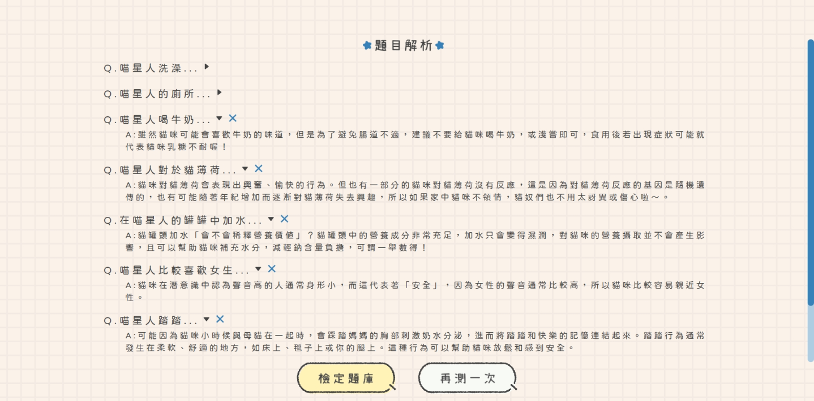
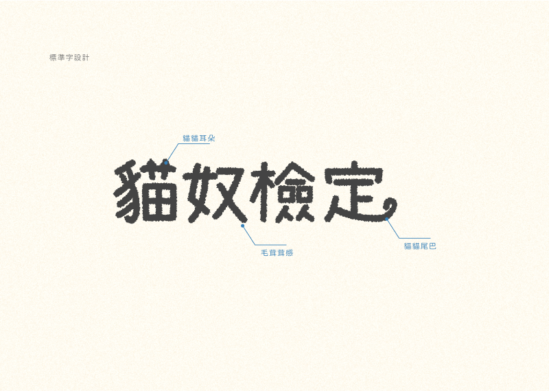
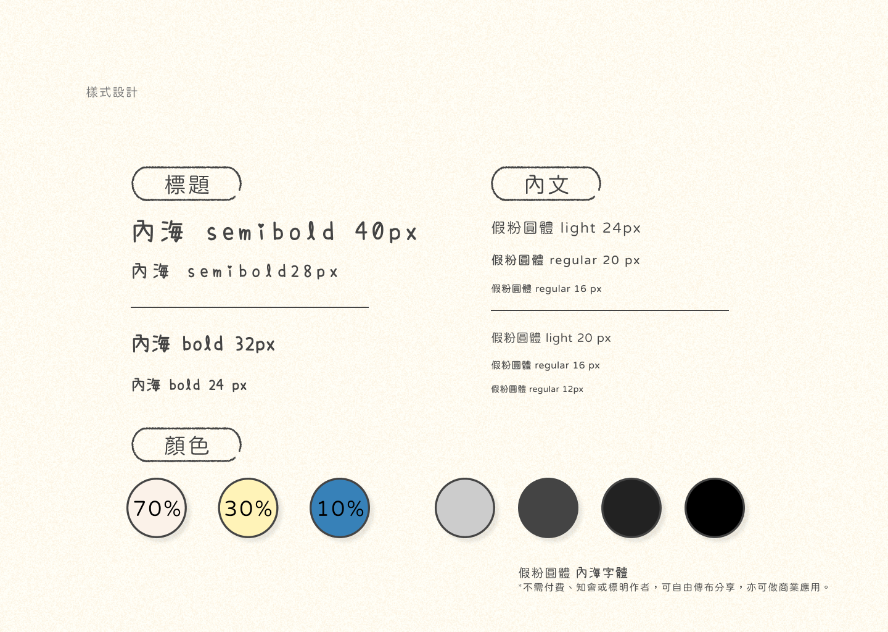
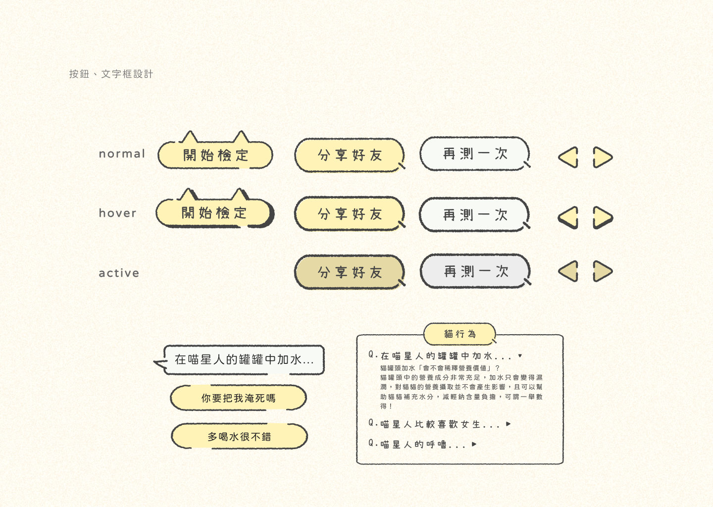
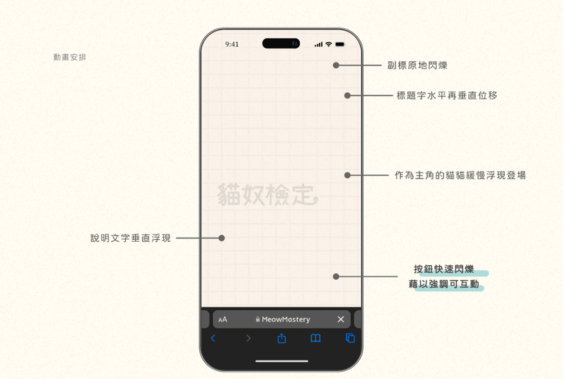
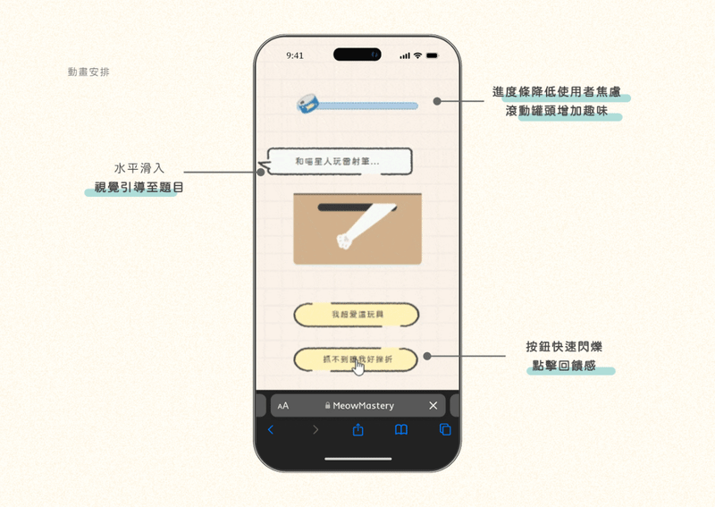
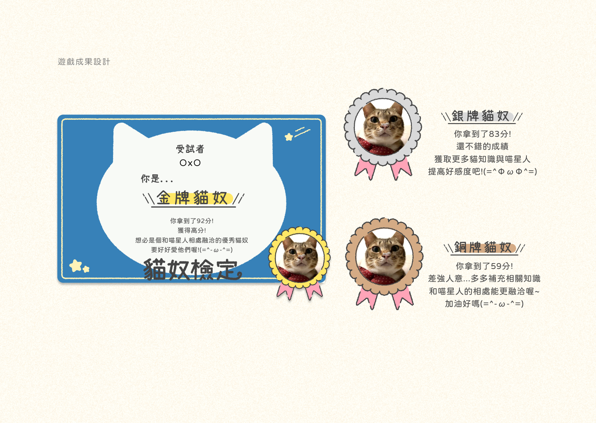
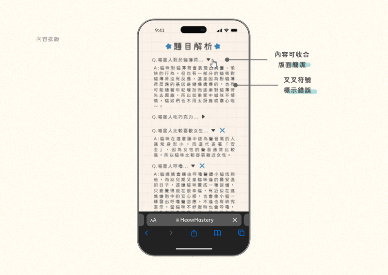

## 🐈 貓奴檢定 - 貓知識測驗

> 想養貓，除了對貓咪的愛是不夠的!想跟喵星人相處融洽，他們的心情與行為、豢養所需物品、 身心保健等知識皆不可或缺，透過測驗小遊戲**貓奴檢定**測試自己是不是稱職貓奴吧!

##### _**👈 手機掃描 QR-code 立即遊玩!**_

##### [你自認是專業貓奴嗎?貓奴檢定考，等你來挑戰!🐈](https://meowmastery.netlify.app/)

---

### 專案特點 ✨ <code>#React</code> <code>#SCSS</code>

#### **⭐ Programing**

<br>

**🐈 建立題庫，每次測驗隨機取題，提高使用者遊玩次數**


```js
// 隨機取題
export const questionPick = (arr, count) => {
  let result = [];
  let questions = arr.slice();
  for (let i = 0; i < count; i++) {
    const index = Math.floor(Math.random() * questions.length);
    result.push(questions[index]);
    questions.splice(index, 1);
  }
  return result;
};
```

<br>

**🐈 依測驗分數及使用者的照片選擇，能產出不同的結果圖，供下載與好友分享**


```js
const imgBox = useRef(null);
const handleImgDownload = () => {
  html2canvas(imgBox.current, {
    backgroundColor: "null",
  }).then((canvas) => {
    const dataUrl = canvas.toDataURL("image/png");
    const link = document.createElement("a");
    link.download = "測驗結果.png";
    link.href = dataUrl;
    link.click();
  });
};
```

<br>

**🐈 將使用者的答題記錄加入題目陣列，完成遊戲後顯現題目解析，不僅知道分數，還能了解答題狀況**


```js
const handleClickAnswer = (e, key) => {
  setScore((score) => [...score, e]);
};
const questionsA = useMemo(() => {
  return questions.map((item, index) => ({
    id: index,
    ...item,
    score: score[index],
    toggle: score.includes(false)
      ? score[index] === false
        ? true
        : false
      : index === 0
      ? true
      : false,
  }));
}, [questions, score]);
```

<br>

#### **⭐ UI/UX**








